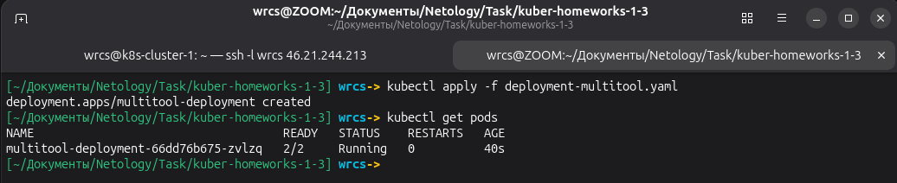
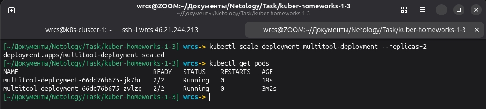
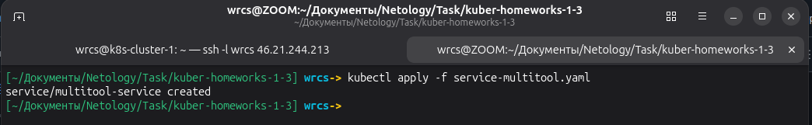
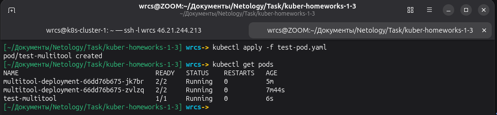
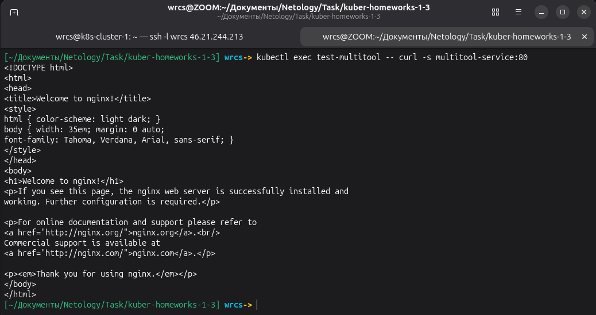
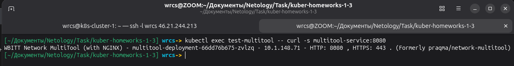
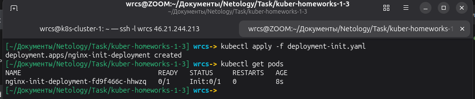
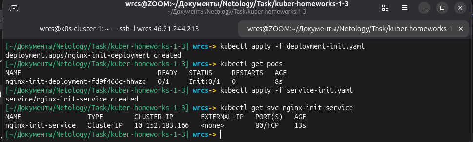
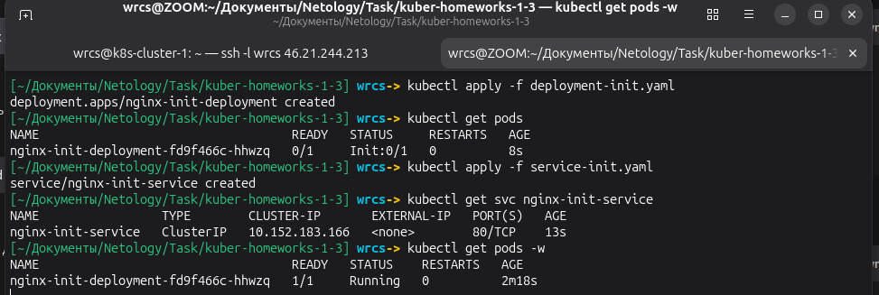

# Домашнее задание к занятию «Запуск приложений в K8S» Малявко С.Н.

### Задание 1. Создать Deployment и обеспечить доступ к репликам приложения из другого Pod

### Задание 2. Создать Deployment и обеспечить старт основного контейнера при выполнении условий

### Файлы манифестов

- [deployment-multitool.yaml](deployment-multitool.yaml)
- [service-multitool.yaml](service-multitool.yaml)
- [test-pod.yaml](test-pod.yaml)
- [service-init.yaml](service-init.yaml)
- [deployment-init.yaml](deployment-init.yaml)

## ✅ ЗАДАНИЕ ВЫПОЛНЕНО
